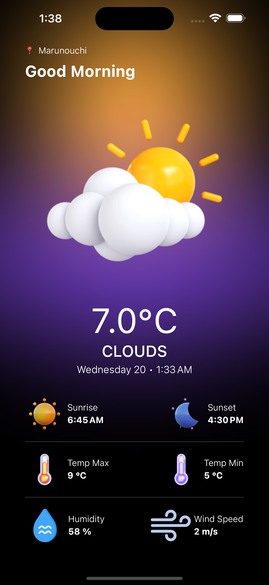

<!-- Improved compatibility of back to top link: See: https://github.com/othneildrew/Best-README-Template/pull/73 -->

[![Contributors][contributors-shield]][contributors-url]
[![Forks][forks-shield]][forks-url]
[![Stargazers][stars-shield]][stars-url]
[![Issues][issues-shield]][issues-url]
[![Watchers][watchers-shield]][watchers-url]
[![MIT License][license-shield]][license-url]

<!-- PROJECT LOGO -->
 

  

  <h3 align="center">Weather Whisper</h3>

  

    Your Daily Weather Companion!
     
    <a href="https://github.com/nino-kin/weather-app"><strong>Explore the docs »</strong></a>
     
     
    <a href="https://github.com/nino-kin/weather-app">View Demo</a>
    ·
    <a href="https://github.com/nino-kin/weather-app/issues">Report Bug</a>
    ·
    <a href="https://github.com/nino-kin/weather-app/issues">Request Feature</a>
  

<!-- TABLE OF CONTENTS -->

  
Table of Contents

  <ol>
    <li>
      <a href="#about-the-project">About The Project</a>
      <ul>
        <li><a href="#built-with">Built With</a></li>
      </ul>
    </li>
    <li>
      <a href="#getting-started">Getting Started</a>
    </li>
    <li><a href="#usage">Usage</a></li>
    <li><a href="#contributing">Contributing</a></li>
    <li><a href="#license">License</a></li>
    <li><a href="#acknowledgments">Acknowledgments</a></li>
  </ol>

## About the project

This is an awesome application that be able to provide the weather information to you. For questions and feedback, please reach out to us [here](https://github.com/nino-kin/weather-app/discussions/landing).

  

### Built With

* [MkDocs](https://www.mkdocs.org/)

<a href="#readme-top">:arrow_up: Back to top</a>

## Getting Started

Learn how to set up and use this application locally.

[Onboarding](./docs/getting_started.md)

<a href="#readme-top">:arrow_up: Back to top</a>

## Usage

Use this space to show useful examples of how a project can be used. Additional screenshots, code examples and demos work well in this space. You may also link to more resources.

_For more examples, please refer to the [Documentation](https://example.com)_

<a href="#readme-top">:arrow_up: Back to top</a>

## Contributing

Contributions are what make the open source community such an amazing place to learn, inspire, and create. Any contributions you make are **greatly appreciated**.

If you have a suggestion that would make this better, please fork the repo and create a pull request. You can also simply open an issue with the tag "enhancement".
Don't forget to give the project a star! Thanks again!

_For more information, please refer to the [Documentation](./CONTRIBUTING.md)_

<a href="#readme-top">:arrow_up: Back to top</a>

## License

Distributed under the MIT License. See [`LICENSE`](./LICENSE) for more information.

<a href="#readme-top">:arrow_up: Back to top</a>

## Acknowledgments

Use this space to list resources you find helpful and would like to give credit to. I've included a few of my favorites to kick things off!

* [Choose an Open Source License](https://choosealicense.com)
* [GitHub Emoji Cheat Sheet](https://www.webpagefx.com/tools/emoji-cheat-sheet)
* [Img Shields](https://shields.io)
* [GitHub Pages](https://pages.github.com)
* [Font Awesome](https://fontawesome.com)

<a href="#readme-top">:arrow_up: Back to top</a>

<!-- MARKDOWN LINKS & IMAGES -->
<!-- https://www.markdownguide.org/basic-syntax/#reference-style-links -->
[contributors-shield]: https://img.shields.io/github/contributors/nino-kin/weather-app.svg?style=for-the-badge
[contributors-url]: https://github.com/nino-kin/weather-app/graphs/contributors
[forks-shield]: https://img.shields.io/github/forks/nino-kin/weather-app.svg?style=for-the-badge
[forks-url]: https://github.com/nino-kin/weather-app/network/members
[stars-shield]: https://img.shields.io/github/stars/nino-kin/weather-app.svg?style=for-the-badge
[stars-url]: https://github.com/nino-kin/weather-app/stargazers
[issues-shield]: https://img.shields.io/github/issues/nino-kin/weather-app.svg?style=for-the-badge
[issues-url]: https://github.com/nino-kin/weather-app/issues
[watchers-shield]: https://img.shields.io/github/watchers/nino-kin/weather-app.svg?style=for-the-badge
[watchers-url]: https://github.com/nino-kin/weather-app/watchers
[license-shield]: https://img.shields.io/github/license/nino-kin/weather-app.svg?style=for-the-badge
[license-url]: https://github.com/nino-kin/weather-app/blob/main/LICENSE
[product-screenshot]: docs/images/screenshot.png
